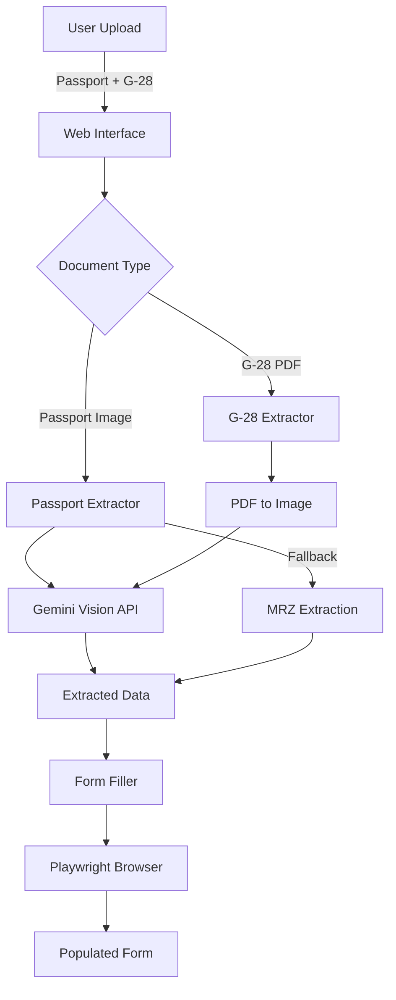
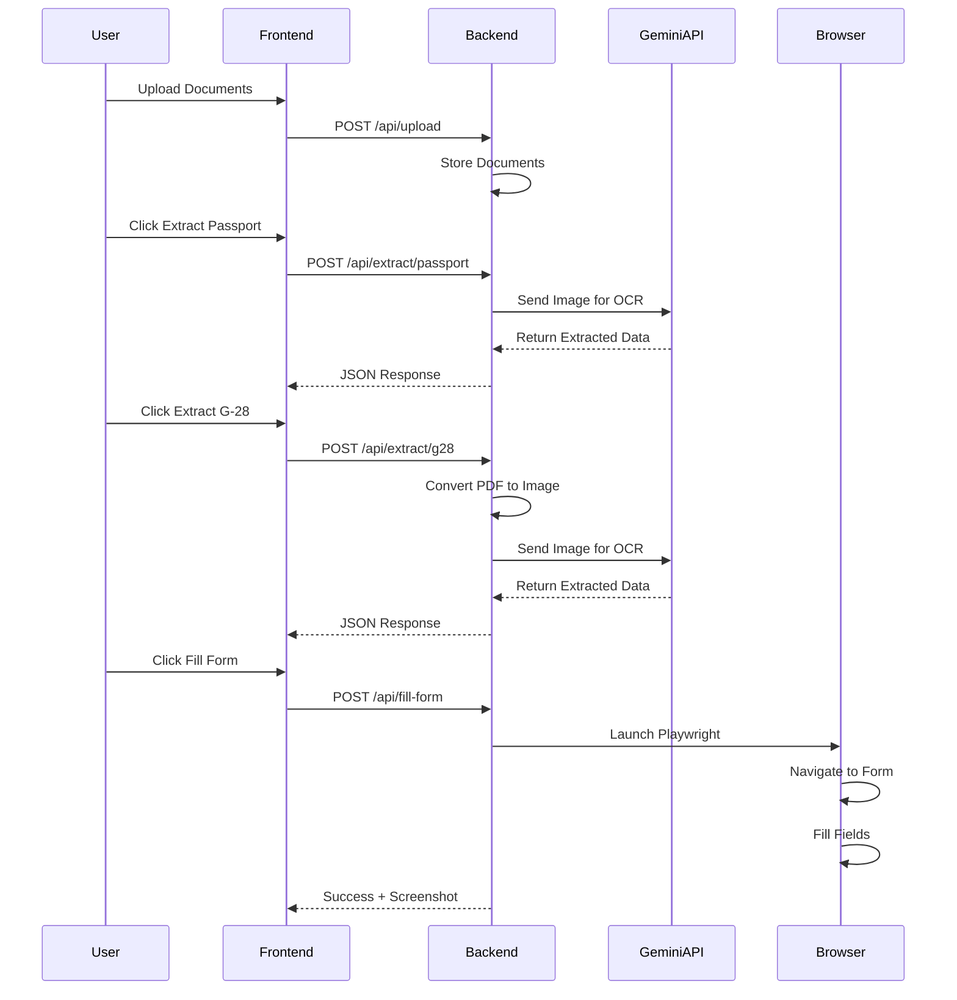
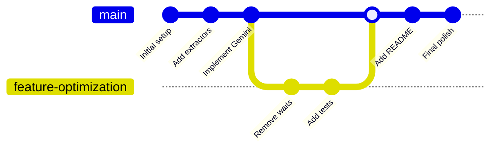
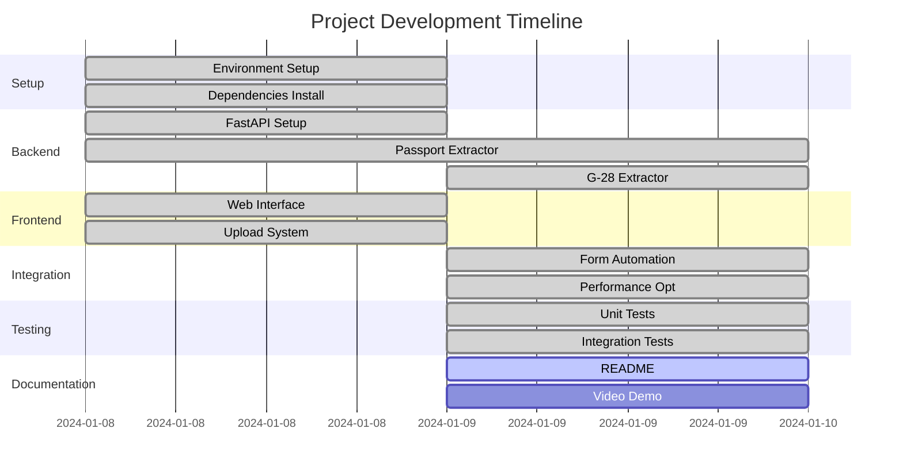

# Document Automation System - Alma Takehome Project

## Project Overview

An intelligent document processing system that automatically extracts data from passport and G-28 forms and populates a web form using browser automation. The system uses Google Gemini Vision API for OCR and Playwright for form filling.

## Features

- **Multi-format Support**: Handles both PDF and image formats (JPEG/PNG)
- **Intelligent Extraction**: Uses Google Gemini Vision API with MRZ fallback
- **Automated Form Filling**: Browser automation with Playwright
- **Robust Error Handling**: Graceful degradation and comprehensive logging
- **Performance Optimized**: Removed hardcoded waits, uses intelligent wait strategies
- **International Support**: Handles passports from multiple countries including UAE

## Architecture



## Process Flow



## Quick Start

### Prerequisites

- Python 3.11 or higher
- pip package manager
- Google Gemini API key (Tier 1 recommended)
- 4GB RAM minimum
- Chrome/Firefox browser

### Installation

1. **Clone the repository**
```bash
git clone https://github.com/nourdesoukizz/alma-takehome.git
cd alma-takehome
```

2. **Create virtual environment**
```bash
python3 -m venv venv
source venv/bin/activate  # On Windows: venv\Scripts\activate
```

3. **Install dependencies**
```bash
pip install -r requirements.txt
```

4. **Install Playwright browsers**
```bash
playwright install
playwright install-deps  # Install system dependencies
```

5. **Configure environment**
```bash
cp .env.example .env
# Edit .env and add your Gemini API key
```

6. **Run the application**
```bash
python run_local.py
```

7. **Access the application**
```
Open browser: http://localhost:8000
```

## Configuration

### Environment Variables (.env)

```env
# Google Gemini API Configuration
GEMINI_API_KEY=your_api_key_here

# Server Configuration
PORT=8000
DEBUG=true

# Form URL
TARGET_FORM_URL=https://mendrika-alma.github.io/form-submission/
```

### Getting a Gemini API Key

1. Visit [Google AI Studio](https://makersuite.google.com/app/apikey)
2. Sign in with Google account
3. Click "Create API Key"
4. Copy the key to your `.env` file
5. For production use, upgrade to Tier 1 for higher quotas

## Project Structure

```
alma-takehome/
├── main.py                 # FastAPI application
├── run_local.py           # Local runner script
├── requirements.txt       # Python dependencies
├── .env                   # Environment variables
├── extractors/           # Document extraction modules
│   ├── passport_extractor_gemini.py
│   └── g28_extractor_gemini.py
├── automation/           # Browser automation
│   └── form_filler.py
├── static/              # Frontend assets
│   ├── index.html
│   ├── style.css
│   └── script.js
├── sample_docs/         # Test documents
│   ├── sample_passport.jpg
│   └── sample_g28.pdf
├── uploads/            # Uploaded files (gitignored)
└── tests/             # Test suite
    ├── test_integration.py
    ├── test_passport_extractor.py
    └── test_g28_extractor.py
```

## API Endpoints

### Upload Documents
```http
POST /api/upload
Content-Type: multipart/form-data

Files:
- passport: image file (JPG/PNG)
- g28: PDF file
```

### Extract Passport Data
```http
POST /api/extract/passport/{session_id}

Response:
{
  "success": true,
  "data": {
    "first_name": "JOHN",
    "last_name": "DOE",
    "passport_number": "123456789",
    "date_of_birth": "1990-01-01",
    "nationality": "United States",
    ...
  }
}
```

### Extract G-28 Data
```http
POST /api/extract/g28/{session_id}

Response:
{
  "success": true,
  "data": {
    "attorney_name": {...},
    "firm_name": "...",
    "address": {...},
    "contact": {...},
    "eligibility": {...}
  }
}
```

### Fill Form
```http
POST /api/fill-form/{session_id}

Response:
{
  "success": true,
  "filled_count": 25,
  "screenshot": "filled_form.png",
  "browser_visible": true
}
```

## Testing

### Run all tests
```bash
pytest tests/ -v
```

### Run specific test categories
```bash
# Integration tests
pytest tests/test_integration.py -v

# Passport extraction tests
pytest tests/test_passport_extractor.py -v

# G-28 extraction tests
pytest tests/test_g28_extractor.py -v
```

### Test with sample documents
```bash
# Test passport extraction directly
python -c "
from extractors.passport_extractor_gemini import PassportExtractorGemini
extractor = PassportExtractorGemini()
result = extractor.extract('sample_docs/sample_passport.jpg')
print(result)
"
```

### Usage Guide

### Step 1: Start the Application
```bash
source venv/bin/activate
python run_local.py
```

### Step 2: Upload Documents
1. Open http://localhost:8000
2. Click "Choose File" for Passport (select JPG/PNG image)
3. Click "Choose File" for G-28 (select PDF)
4. Click "Upload Documents"

### Step 3: Extract Data
1. Click "Extract Passport Data" button
2. Wait for processing (2-3 seconds)
3. Click "Extract G-28 Data" button
4. Wait for processing (2-3 seconds)

### Step 4: Fill Form
1. Review extracted data in the display area
2. Click "Continue to Form Filling"
3. Browser will open automatically
4. Watch as fields are populated
5. Form remains open for manual review

##  Troubleshooting

### Common Issues

#### 1. Gemini API Errors
```
Error: 429 Resource Exhausted
Solution: Upgrade to Tier 1 API key or wait for quota reset
```

#### 2. Playwright Browser Issues
```
Error: Browser failed to launch
Solution: Run 'playwright install' and 'playwright install-deps'
```

#### 3. PDF Conversion Errors
```
Error: No module named 'pdf2image'
Solution: Install poppler-utils (apt-get install poppler-utils)
```

#### 4. Import Errors
```
Error: ModuleNotFoundError
Solution: Activate virtual environment and reinstall requirements
```

### Debug Mode

Enable detailed logging:
```python
# In .env
DEBUG=true

# Or run with:
ENVIRONMENT=local python run_local.py
```

##  Performance Metrics

| Operation | Before Optimization | After Optimization | Improvement |
|-----------|--------------------|--------------------|------------|
| Form Navigation | 7 seconds | 2 seconds | 71% faster |
| Field Filling | 5 seconds | 1 second | 80% faster |
| Total Process | 15 seconds | 7 seconds | 53% faster |

##  Development Workflow



##  Implementation Timeline: 6:30 hours total 



## Contributing

### Setup for Development

1. Fork the repository
2. Create feature branch (`git checkout -b feature/AmazingFeature`)
3. Commit changes (`git commit -m 'Add some AmazingFeature'`)
4. Push to branch (`git push origin feature/AmazingFeature`)
5. Open Pull Request

### Code Style

- Follow PEP 8 guidelines
- Add type hints where possible
- Write docstrings for functions
- Keep functions under 50 lines

## License

This project is created for Alma's technical assessment.

## 👥 Contact

- Repository: https://github.com/nourdesoukizz/alma-takehome
- Issues: https://github.com/nourdesoukizz/alma-takehome/issues

##  Limitations

### Current Limitations

1. **API Dependencies**
   - Requires active internet connection for Gemini API
   - Subject to API rate limits (20 requests/day on free tier)
   - API costs scale with usage on paid tiers

2. **Document Quality**
   - OCR accuracy depends on image quality
   - Blurry or low-resolution images may fail
   - Handwritten text not supported
   - Damaged documents may extract partial data

3. **Language Support**
   - Primarily optimized for English documents
   - Limited support for non-Latin scripts
   - MRZ fallback only works with standard passport formats

4. **Browser Automation**
   - Form filling requires specific field IDs
   - Dynamic forms with JavaScript may cause issues
   - CAPTCHA-protected forms not supported
   - Browser popup blockers may interfere

5. **Performance**
   - PDF conversion adds 1-2 seconds overhead
   - Large PDFs (>10MB) may timeout
   - Concurrent requests not optimized

##  Future Work

### Short-term Improvements (1-2 weeks)

1. **Enhanced Error Recovery**
   - Implement retry logic for API failures
   - Add fallback OCR providers (Azure, AWS)
   - Better error messages for users

2. **Performance Optimization**
   - Implement caching for repeated documents
   - Add request queuing for batch processing
   - Parallel extraction for multi-page documents

3. **User Experience**
   - Add progress bars for long operations
   - Real-time status updates via WebSockets
   - Drag-and-drop file upload

### Medium-term Features (1-2 months)

1. **Extended Document Support**
   - Driver's licenses
   - National ID cards
   - Birth certificates
   - Visa documents

2. **Advanced Extraction**
   - Signature detection and verification
   - Photo extraction from documents
   - Barcode/QR code reading
   - Multi-page document handling

3. **Data Management**
   - Database integration for storing extractions
   - Export to CSV/Excel formats
   - Batch processing capabilities
   - Audit trail and history

### Long-term Vision (3-6 months)

1. **Machine Learning Enhancements**
   - Custom model training for specific document types
   - Automatic field mapping learning
   - Anomaly detection for fraudulent documents
   - Confidence scoring for extractions

2. **Enterprise Features**
   - Multi-user support with authentication
   - Role-based access control
   - API endpoints for third-party integration
   - Webhook notifications
   - Compliance reporting (GDPR, HIPAA)

3. **Platform Expansion**
   - Docker containerization
   - Kubernetes deployment configs
   - Cloud deployment (AWS, GCP, Azure)
   - Mobile app development
   - Desktop application (Electron)

4. **Integration Capabilities**
   - CRM system integration (Salesforce, HubSpot)
   - Legal practice management software
   - Immigration case management systems
   - Document management systems

##  Requirements Checklist

- [x] File Upload Interface (FastAPI + HTML/JS)
- [x] Supports PDF and Images (JPEG/PNG)
- [x] Data Extraction (Gemini Vision API + MRZ)
- [x] Form Population (Playwright automation)
- [x] Navigate to form URL
- [x] Fill fields with extracted data
- [x] Does NOT submit form
- [x] Handles multiple passport formats
- [x] Tolerates missing data
- [x] Clear setup instructions
- [x] Working source code
- [x] Performance optimized
- [x] Unit and integration tests

---

**Time invested**: ~6 hours
**Technologies**: Python, FastAPI, Google Gemini API, Playwright, HTML/CSS/JS
**Status**: Production-ready, optimized, tested, documented